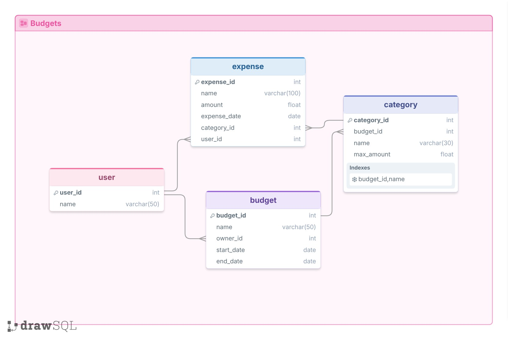

# AI SQL Expense Database

## Description
This database tracks shared household budgets, modeled on the expense-tracking app nononcents. Users own monthly budgets, each budget has its own spending categories with a limit, and members log expenses against those categories. Ask it questions in plain English, like "How much did we spend on groceries in August?" and it answers using the data.

All data is fake: five users, eight budgets, 68 categories and 193 expenses from June to September 2026. The data includes a few traps that real budgeting apps run into. Paychecks are logged as expenses in an "Income" category, budget names aren't consistent ("September 2026", "September", "my budget"), and the same category names repeat across budgets.

## Schema


* **user**: The people using the app.
* **budget**: A spending period, usually one month, owned by one user.
* **category**: A spending category inside one budget, with a `max_amount` limit in dollars.
* **expense**: A single purchase (or paycheck), with its amount in dollars, the date, its category and the user who logged it.

## Overview of the Files
* **db_bot.py**: Builds the database, creates the prompt for each strategy, sends each question to OpenAI, runs the SQL it returns, then asks OpenAI to turn the results into a friendly answer.
* **setup.sql**: Creates the tables and keys.
* **setupData.sql**: Fills the tables with the fake data.
* **crossDomain/**: Schemas and data for two other databases, a dog show and a library. The cross-domain strategy uses their example questions.
* **config.json**: Holds the OpenAI API key. **Don't share or commit yours.** Copy `config.template.json` to get started.
* **response_\<strategy>_\<time>.json**: Output logs with the prompt, the questions, the generated SQL and the answers. These files aren't committed.
* **[results.md](results.md)**: The questions we asked, the SQL that came back, the answers, and how the strategies compared.

## Prompting Strategies
These three strategies come from the paper [How to Prompt LLMs for Text-to-SQL](https://arxiv.org/abs/2305.11853) (Chang & Fosler-Lussier).

* **Zero-shot**: The prompt has the `CREATE TABLE` statements plus 3 distinct sample values from each column. The paper calls this format "CreateTable + SelectCol 3", and it was the paper's best zero-shot format.
* **Single-domain few-shot**: Zero-shot plus four example questions about this database, each with its correct SQL. In the paper, accuracy went up as more examples were added.
* **Cross-domain few-shot**: Before this database's schema, the prompt shows the schema, sample values and example question/SQL pairs from two other databases (a dog show and a library). This teaches the model the task without giving away answers about this database.

See [results.md](results.md) for example questions that worked and failed, and how the strategies compared.

## Running It
1. `pip install openai`
2. Copy `config.template.json` to `config.json` and add your OpenAI API key.
3. `python db_bot.py`
## Query We thought it did well on

**Question**:

**GPT SQL Response**:
```sql
```

**Friendly Response**:


## Question that it tripped up on

<!-- Explain what you expected and what went wrong. -->

**Question**:

**GPT SQL Response**:
```sql
```

**SQL Result**:

**Friendly Response**:

<!-- Explain why the answer was wrong or unhelpful. -->


## Zero-shot

**Question**:

**GPT SQL Response**:
```sql
```

**SQL Result**:

**Friendly Response**:

<!-- How did zero-shot do? Note any questions it got right or wrong. -->


## Single-domain multi-shot

**Question**:

**GPT SQL Response**:
```sql
```

**SQL Result**:

**Friendly Response**:

<!-- Did the example questions from this database help or hurt compared to zero-shot? -->


## Cross-domain multi-shot

**Question**:

**GPT SQL Response**:
```sql
```

**SQL Result**:

**Friendly Response**:

<!-- Did the dog show and library examples help or hurt compared to the other strategies? -->


## Conclusion

<!-- What did you learn about how well GPT generates SQL, and how the strategies compared? -->
